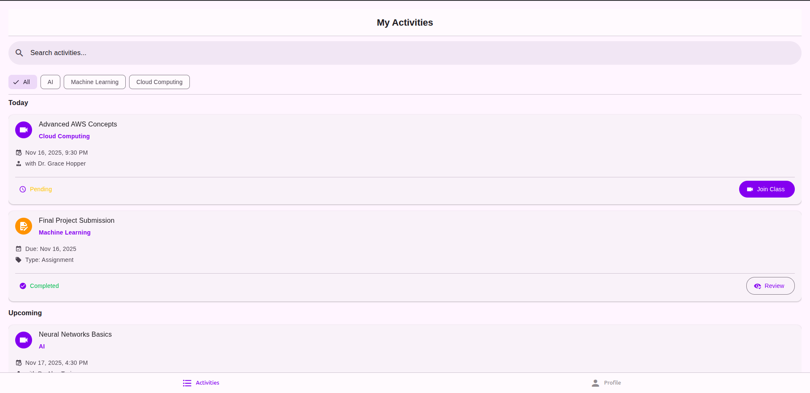
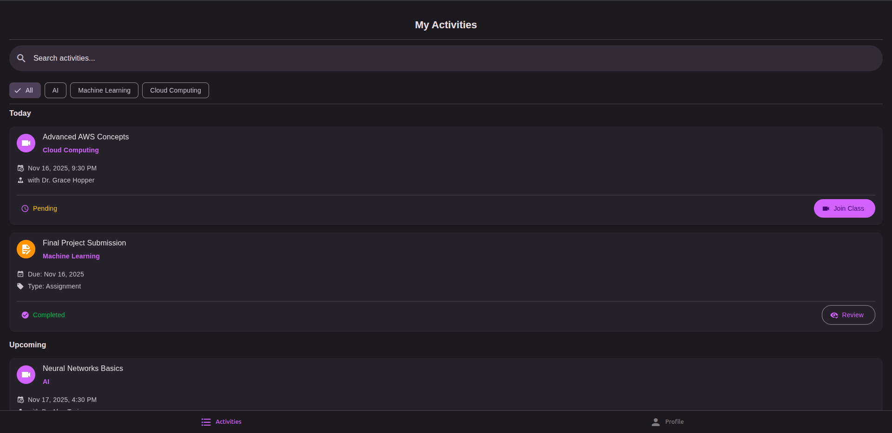
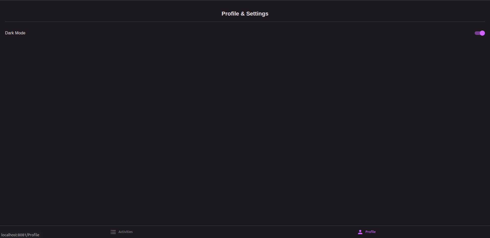
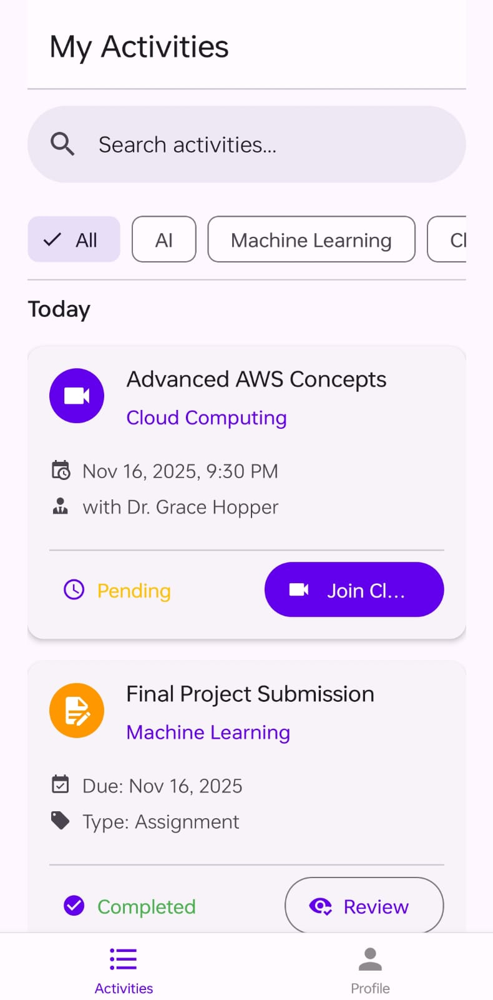
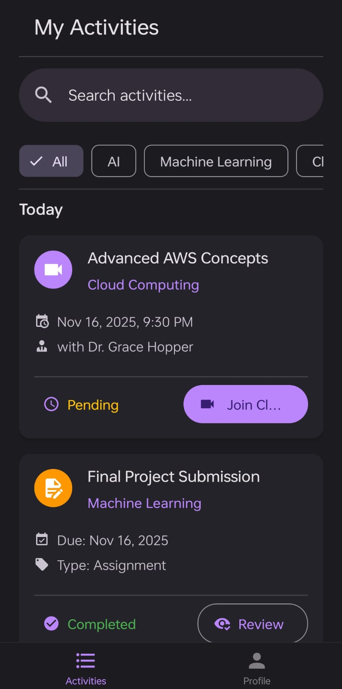
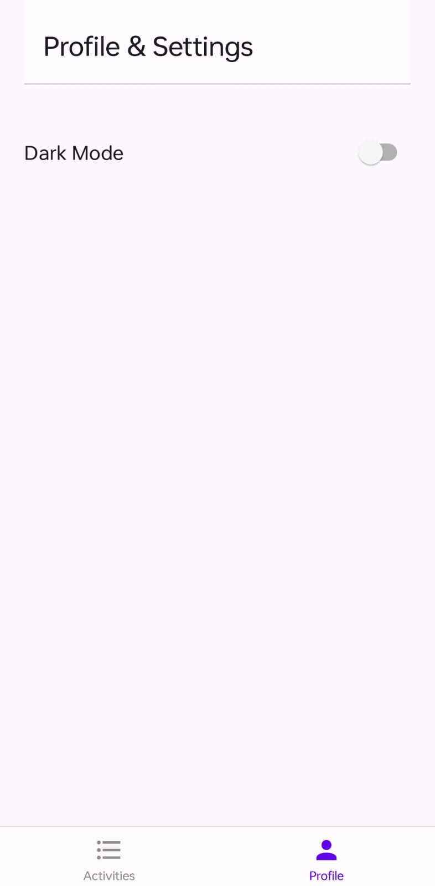

# Great Learning - Full Stack Developer Assignment (educross-app)

This project is a high-quality, production-ready, cross-platform (Web, iOS, Android) application built to satisfy the "Activity Listing Page" problem statement. It's built from a single TypeScript codebase using React Native and Expo.

---

## 🚀 Key Features

- **Cross-Platform:** A single codebase that runs natively on iOS, Android, and on the Web.
- **Responsive UI:** The UI adapts to all screen sizes, with platform-specific header alignment.
- **Component-Based:** Built with reusable, data-driven components (e.g., `ActivityCard`).
- **Dynamic Filtering:** Users can filter the activity list by program ("All," "AI," "ML," "Cloud").
- **Live Search:** Users can search for activities by title in real-time.
- **Light/Dark Mode:** Full support for system-based and user-toggled light and dark themes.
- **Type-Safe:** Written entirely in TypeScript for production-ready code.
- **Modern UX:**
  - **Skeleton Loaders:** Shows a professional loading state before data appears.
  - **Section Headers:** Groups activities by date ("Today," "Upcoming," "Past Activities") using a `SectionList`.
  - **Polished Empty State:** A clean, icon-based message appears when no activities are found.
- **Unit Tested:** Includes a basic Jest & React Native Testing Library test suite for component validation.

---

## 🛠 Tech Choices & Tradeoffs

| Technology                 | Rationale                                                                                                                                                                                                                     |
| :------------------------- | :---------------------------------------------------------------------------------------------------------------------------------------------------------------------------------------------------------------------------- |
| **React Native (Expo)**    | The assignment required a single codebase for web and native. Expo is the leading solution for this, providing fast setup, a managed workflow, and a powerful "Expo Go" companion app for live mobile testing.                |
| **React Native Paper**     | The assignment preferred a design library supporting both web and native. React Native Paper is a high-quality, Material Design library that works perfectly on both platforms and has built-in support for light/dark modes. |
| **React Navigation**       | The standard for routing in React Native. We used the Bottom Tab Navigator, which provides a consistent and familiar UI on all platforms.                                                                                     |
| **TypeScript**             | Chosen for code quality, maintainability, and type safety, which is expected in a "production-ready" application.                                                                                                             |
| **Jest & Testing Library** | Added to demonstrate a professional workflow that includes unit testing for component reliability.                                                                                                                            |
| **Local Mock Data**        | Per the problem statement, data is mocked locally (`src/data/mockData.ts`) instead of being fetched from a live API. This allowed for a faster build focused on the frontend requirements.                                    |

---

## 🏃 How to Run the Application

This project uses the **Expo** framework.

**1. Clone the repository:**

```bash
git clone [https://github.com/gupta-arpan/Educross.git]

cd Educross
```

**2. Install dependencies:**

```bash
npm install
```

**3. To Run on Web:**

```bash
npm run web
```

This will open the application in your default web browser.

**4.To Run on Mobile (iOS or Android):**

Prerequisite: You must have the "Expo Go" companion app installed on your physical device from the App Store / Play Store.

1. Start the Metro server:

```bash
npm start
```

2. Scan the QR Code: A QR code will appear in your terminal. Open the "Expo Go" app on your phone and scan the QR code to launch the application.

**5.To Run Tests**

```bash
npm test
```

This will run the Jest test suite and show the results in your terminal.

---

## 📂 Project Structure

Here is the folder and file structure for the application's source code:

```
educross-app/
├── App.tsx                     # Main app entry point (manages theme)
├── app.json                    # Expo configuration
├── package.json                # Project dependencies & scripts
├── tsconfig.json               # TypeScript configuration
├── README.md                   # This file
├── assets/                     # Default static assets (icon, etc.)
└── src/                        # Main application source code
    ├── components/             # Reusable UI components
    │   ├── ActivityCard.tsx
    │   ├── ActivityCardSkeleton.tsx
    │   ├── AppHeader.tsx
    │   ├── FilterChip.tsx
    │   ├── FilterChip.test.tsx   # Component unit test
    │   └── ScreenWrapper.tsx
    ├── data/                   # Mock data
    │   └── mockData.ts
    ├── navigation/             # Navigation and routing
    │   └── AppNavigation.tsx
    ├── screens/                # App screens (views)
    │   ├── ActivityListScreen.tsx
    │   └── ProfileScreen.tsx
    ├── theme/                  # Theme & styling
    │   ├── theme.ts            # Light/Dark mode color definitions
    │   └── ThemeContext.tsx    # Context for toggling theme
    ├── types/                  # TypeScript type definitions
    │   ├── index.ts            # Main 'Activity' types
    │   └── theme.d.ts          # Theme type augmentations
    └── utils/                  # Helper functions
        └── dateUtils.ts        # Date formatting & grouping logic
```

## Screenshots

### Web

| Light Mode | Dark Mode |
| :---: | :---: |
|  |  |
|  |  |

### Mobile

| Light Mode | Dark Mode |
| :---: | :---: |
|  |  |
|  |  |

## Limitations & Next Steps (v2)

- **Real API:** The data is currently mocked. The next step would be to replace the `MOCK_ACTIVITIES` import with a `useEffect` hook that fetches data from a real backend API.
- **Navigation:** The "Action" buttons on the cards (e.g., "Start," "Review") currently only show an alert. The next step would be to use React Navigation to move the user to a detailed screen for that specific activity.
- **Full Tappable Cards:** A planned enhancement is to make the entire `ActivityCard` pressable, not just the action button, to improve mobile usability.
- **Pull to Refresh:** Adding a "pull to refresh" gesture to the list would be a standard native feature to re-fetch data.
